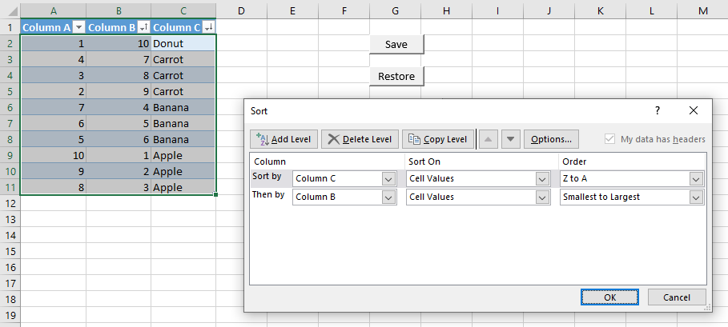

# excel-persistent-sort
Save and restore Sort Order for Tables in Excel.

# Description
When using the Custom Sort function with multiple columns, sometimes the sort order disappears: the columns, the order you placed them in, and the order in which the values are sorted. This small tool allows you to save and restore the sort order. 



Add the macros `SaveSortOrderSelected` and `RestoreSortOrderSelected` to your ribbon, and remember to have your selection inside a table when using it.

## How does it work?
First it converts the current Custom Sort order into a string. For a Table occupying the range A1:C11, sorted first by the 3rd column in descending order, then by the second column in ascending order, the string would look like this:

```
ORDER $A$1:$C$11 BY $C$2:$C$11 DESC, $B$2:$B$11 ASC;
```

We use cell references instead of table and column names in case they change. Adding or removing rows will not affect the ability to restore the sort order, but adding or removing columns will. 

Additionally, if columns are removed and an equal amount are added, the sort order will restore based on the numerical order of the saved columns. i.e, if you remove column 3 and add a new column 3 with different data, it will not understand that this column 3 is different. It will try to sort it as the original was sorted.

The above sort string is then saved in a hidden Named Range on the worksheet. The Named Range is the same range as the table, so it should work when copying or moving it across worksheets or workbooks.

# TODO
- [ ] Try and implement custom sorting
- [ ] Try and save sort string with both column name and range, and try to match by column name first.
- [ ] Consider handling sort by color and icon
- [ ] Save Case Sensitivity option