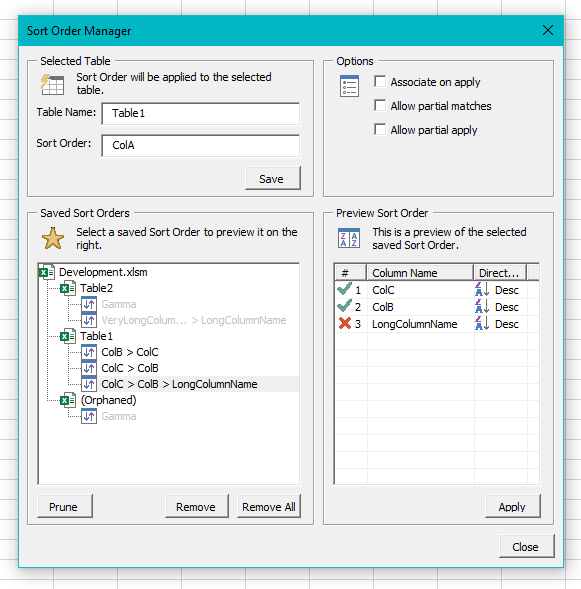

# excel-persistent-sort
Save and restore the Sort Order of Tables in Excel. 

Sometimes Excel will reset the Sort Order, which is particularly annoying when you are sorting by several columns. This tool lets you save and restore the sort order, and these saved states persists across closing the file.

## Features
- Save the state of Sort Orders in workbooks persistently (using CustomXML object).
- Restore saved Sort Order States.
- Partially restore any Sort Order State to a table if at least one column is present.
- Re-associate orphaned Sort Order States (i.e., Table name changed).
- Import and Export Sort Order States manually (using Base64 encoded strings).
- Supports sorting by Value (including Custom Lists), Icons, Cell color, and Font color.

## Notes
- The state of the Sort Order for a ListObject is stored by storing each SortField as a comma separated string, and the list of SortField strings as a semicolon separated string. Properties of type String are encoded as Base64 to avoid having to deal with escaping characters.

## Screenshots

# Reference
- [Sort.SortFields property (Excel) | Microsoft Learn](https://learn.microsoft.com/en-us/office/vba/api/excel.sort.sortfields)
- [XlSortOrder enumeration (Excel) | Microsoft Learn](https://learn.microsoft.com/en-us/office/vba/api/excel.xlsortorder)
- [XlSortOn enumeration (Excel) | Microsoft Learn](https://learn.microsoft.com/en-us/office/vba/api/excel.xlsorton)