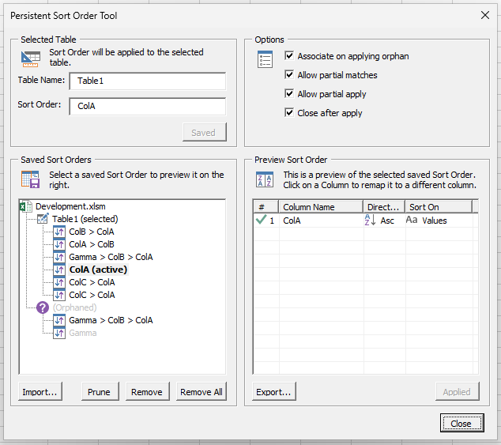
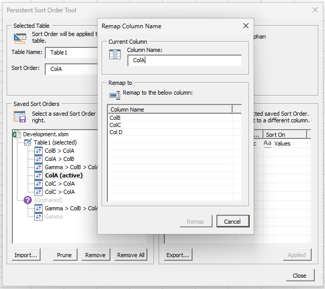

# excel-persistent-sort
Save and restore the Sort Order of Tables in Excel. 

Sometimes Excel will reset the Sort Order of the columns in the Table you are working with, which is particularly annoying when you are sorting by several columns. This tool lets you save and restore the sort order, and those saved states persist across closing the file.

## 📸 Screenshots

## ⭐ Features
- Save the state of Sort Orders in workbooks persistently (using CustomXML object).
- Restore saved Sort Order States.
- Partially restore any Sort Order State to a table if at least one column is present.
- Re-associate orphaned Sort Order States (i.e., Table name changed).
- Import and Export Sort Order States manually (using Base64 encoded strings).
- Supports sorting by Value (including Custom Lists), Icons, Cell color, and Font color.

## 📝 Notes
- 📃 [Change Log](Notes/ChangeLog.md)
- 🚧 [TODO List](Notes/TODO.md)
- ☕ [Dev Notes](Notes/DevNotes.md)

# 🙏 Thanks
- Developed using [Rubberduck VBA](https://github.com/rubberduck-vba/Rubberduck).